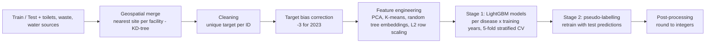

# SUA Outsmarting Outbreaks Challenge — 2nd Place Solution 🥈

**Competition:** [SUA Outsmarting Outbreaks Challenge](https://zindi.world/competitions/outsmarting-outbreaks-challenge) (Zindi)
**Organizers:** Sokoine University of Agriculture (Tanzania), AWS & IRCAI, with data from the Amazon Sustainability Data Initiative (ASDI)
**Author:** [Ahmed El Fazouani](https://zindi.africa/users/AhmedElFazouani) — final rank **2nd out of 814 participants**
**Final score (MAE):** public leaderboard **5.3917** · private leaderboard **6.4911**

## Problem

In Tanzania, climate-sensitive waterborne diseases (typhoid, diarrhoea, amoebiasis, schistosomiasis, intestinal worms) pose a serious health risk, especially for women and children. The goal of the challenge was to build a model that **predicts the number of cases per health facility, disease and period**, using data on water sources, toilet quality, waste management, health facilities and climate (2019–2023). Such predictions help governments and health organisations anticipate outbreaks and target interventions.

The evaluation metric is the **Mean Absolute Error (MAE)**.

## Solution overview

A two-stage LightGBM pipeline, trained and run end to end in a single notebook (`code.ipynb`), **on CPU in under 30 minutes**.



### 1. Data integration
Each health facility is linked to its **nearest** water source, toilet facility and waste-management site using a KD-tree nearest-neighbour search on the GPS coordinates (`scipy.spatial.cKDTree`), then the supplementary tables are merged in.

### 2. Data cleaning
Several rows share exactly the same features for a given ID and year but carry different targets. Training a model on identical inputs with different outputs is harmful, so the target was made unique per ID (mean or max, depending on the model).

### 3. Target bias correction
The mean of the target per year shows a constant downward bias. The 2023 (test) target was therefore shifted by **−3** to respect the same trend.

### 4. Feature engineering
From the numerical columns: **PCA components**, **K-means cluster ids** and **random tree embeddings**, followed by **row-wise L2 normalisation**.

### 5. Modelling and validation
- **LightGBM** with early stopping — `objective = mae`, `learning_rate = 0.03`, `max_depth = 5`, `boosting = goss`, `top_rate = 0.3`, `seed = 42`.
- Separate models **per disease** and **per training window** (2022 only, and 2021 + 2022), then ensembled for diversity.
- **5-fold StratifiedKFold**, stratified on *location + disease*, computed on the most recent year (2022) only.
- Historical data from 2019 and 2020 was **dropped**: it degraded cross-validation.
- **Location was not used as a feature** because the test set contains locations absent from the training set.

### 6. Stage 2 — pseudo-labelling
Stage-1 test predictions are added to the training set as pseudo-labels and the whole training procedure is repeated.

### 7. Post-processing
Predictions are **rounded to integers** (case counts), which improved both CV and leaderboard scores.

## Results

| Submission | Public LB (MAE) | Private LB (MAE) |
|---|---|---|
| Stage 1 | 5.398 | 6.472 |
| Stage 2 (final) | **5.392** | **6.491** |

The two stages are very close: pseudo-labelling brought only a marginal change.

## Repository structure

```
.
├── code.ipynb          # full pipeline: preprocessing, training, inference, submission
├── documentation.pdf   # written description of the solution
├── requirements.txt    # pinned Python dependencies
└── LICENSE             # MIT
```

## How to reproduce

1. Download the competition data from the [Zindi data page](https://zindi.world/competitions/outsmarting-outbreaks-challenge/data) and place `Train.csv`, `Test.csv`, `toilets.csv`, `waste_management.csv` and `water_sources.csv` next to the notebook.
2. Install the dependencies:
   ```bash
   pip install -r requirements.txt
   ```
3. Run `code.ipynb` from top to bottom. All seeds are fixed (`42`), so the run is deterministic.

**Environment:** Python 3, pandas 2.2.3, scikit-learn 1.6.1, LightGBM 4.5.0, SciPy 1.15.1. No GPU required — total train + inference time is below 30 minutes on a standard CPU.

## Contact

Questions are welcome: elfazouaniah@gmail.com · [Zindi](https://zindi.africa/users/AhmedElFazouani) · [Kaggle](https://www.kaggle.com/ahmedelfazouan)

## License

This project is released under the [MIT License](LICENSE).
